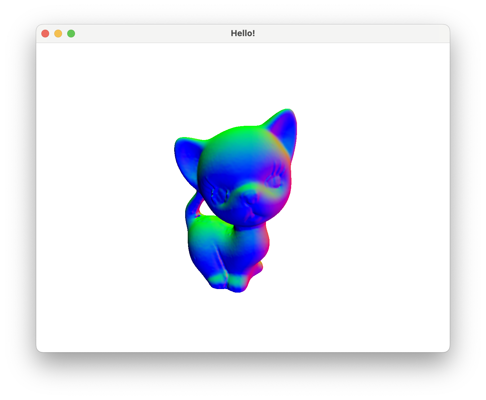

# OpenGL Viewer の実装

OpenGLとGLFWを用いたメッシュビューワーのサンプルの実装．  
研究の効率化を図る目的で作成．  
和歌山大学床井教授が公開されている資料[OpenGLdraft.pdf](https://tokoik.github.io/GLFWdraft.pdf) をもとに作成．

* 使用言語：C++
* 使用ライブラリ：Eigen

資料では，メッシュの表示方法については書かれていないため，新たに`Mesh.h`をかき，メッシュを読み込んで描画するようにした．
